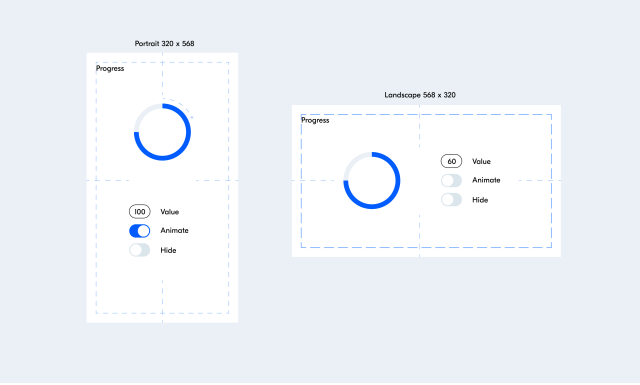

# **pages:** https://salooomon.github.io/progress-circle-task/

## Задача
Разработать прототип блока Progress для использования в мобильных web-приложениях.  
Основное предназначение блока – отображать процесс выполнения процессов и их прогресс выполнения.

## Технологии
- **JS** (без jQuery и других библиотек / фреймворков, упрощающих и дополняющих функциональность окружения браузера).
- **CSS** или любые другие пре/постпроцессоры.
- **HTML** (без использования шаблонизаторов).

